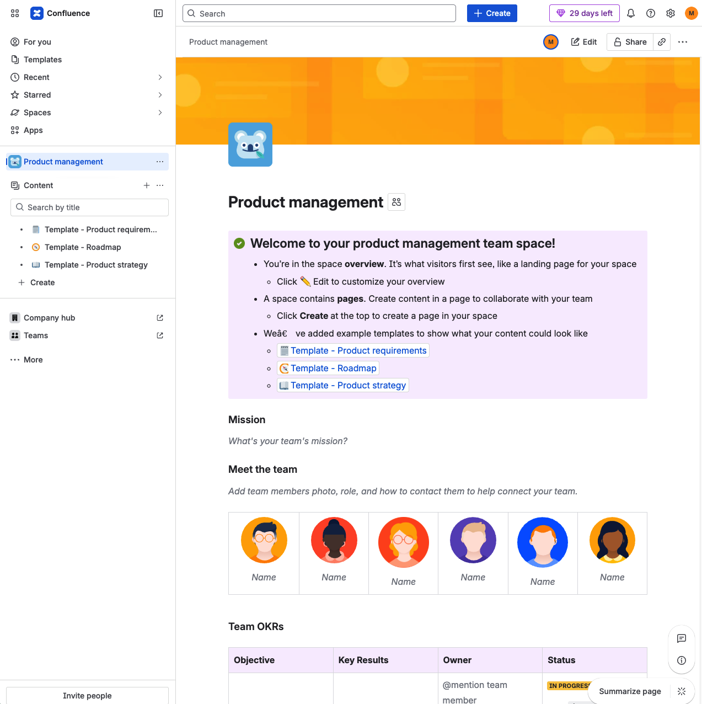
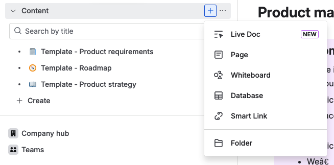

1. Confluence Konsolunu Tanıyalım (Görsel Analizi)
Şu an bir Space (Alan) içindesiniz. DevOps dünyasında genellikle her büyük proje için bir "Space" açılır.

Sol Menü (Content): Burası klasör yapınızdır. Sayfalarınızı hiyerarşik olarak burada tutarsınız. "Template" olarak gelen sayfaları silmeyin, onları DevOps dokümanlarına çevireceğiz.

Create Butonu (Üstte): Yeni bir doküman, toplantı notu veya kurulum rehberi oluşturmak için ana merkeziniz.

Space Overview (Orta Alan): Ekranın ortasındaki bu alan ekibin "Landing Page"idir. Buraya projenin Jenkins URL'ini, Kubernetes Dashboard linkini ve GitHub reposunu "Shortcut" (Kısayol) olarak eklemek profesyonel bir yaklaşımdır.

Meet the Team: Buraya kendi avatarlarınızı ve uzmanlık alanlarınızı (örn: Jenkins Admin, K8s Engineer) yazarak başlayabilirsiniz.

1. Profesyonel Başlangıç: "Space" Yapılandırması
Market standartlarında (Trendyol, Getir veya büyük global şirketler) bir DevOps takımı Confluence'ı şu 3 ana klasörle yönetir. Sizin de ilk yapmanız gereken bunlar için sayfalar açmak:

Technical Documentation (Teknik Dokümantasyon):

eShopOnWeb Architecture: Uygulamanın nasıl çalıştığı.

CI/CD Pipeline Schema: Jenkins akışının diyagramı.

Kubernetes Cluster Setup: Cluster'ı nasıl kurduğunuzun notları.

Meeting Notes (Toplantı Notları):

Her hafta yapacağınız toplantıların kararları burada tutulur. (Jira ile en çok bağlandığı yer burasıdır).

Operations / Runbooks:

"Sistem çökerse ne yapmalı?" rehberleri.

Görsel: İçerik Oluşturma Seçenekleri
Sol menüdeki "+" (Create) butonuna bastığınızda karşınıza çıkan bu seçenekler, bilginin formatını belirler:

Live Doc: Statik bir sayfa yerine, üzerinde gerçek zamanlı verilerin (Jira listeleri veya diğer canlı metrikler) olduğu interaktif dokümanlardır.

Page: En temel birimdir. Teknik kurulum rehberlerinizi, pipeline detaylarını ve genel bilgileri yazacağınız standart boş sayfadır.

Whiteboard: DevOps mimarisini (Örn: Jenkins'ten Kubernetes'e giden akış şeması) çizmek için kullanılan dijital beyaz tahtadır. Arkadaşınızla aynı anda çizim yapabilirsiniz.

Database: Proje envanterlerini tutmak için harikadır. Örneğin; "Hangi Microservice hangi portta çalışıyor?" gibi bilgileri tablolaştırmak için kullanılır.

Smart Link: Dış kaynakları (GitHub reponuz veya Docker Hub linkiniz gibi) sayfaya "akıllı" bir şekilde gömmenizi sağlar.

Folder: Sayfalarınızı kategorize etmek için kullanılan klasör yapısıdır.
