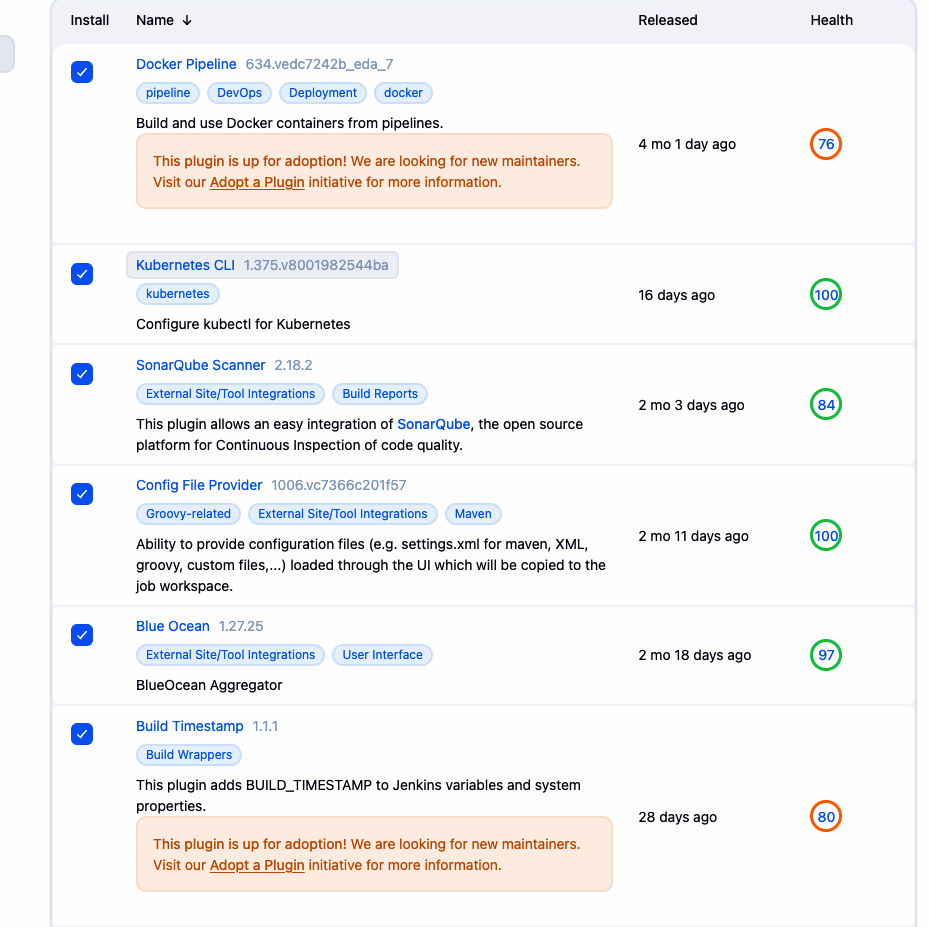
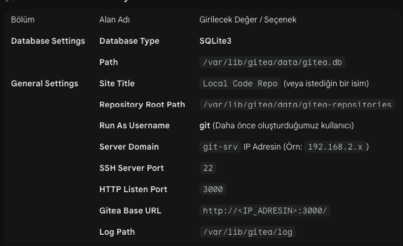

# Kubernetes Cluster

multipass launch --name k8s-master --cpus 2 --memory 1.5G --disk 15G
multipass launch --name k8s-worker --cpus 2 --memory 4.5G --disk 30G

# CI/CD ve Security

multipass launch --name jenkins-srv --cpus 2 --memory 3G --disk 35G
multipass launch --name security-srv --cpus 2 --memory 3G --disk 20G

# git-srv makinesini 512MB RAM ve 10GB Disk ile başlat

multipass launch --name git-srv --cpus 1 --memory 512M --disk 10G

# K3S Kurulumu traefik olmadan

multipass exec k8s-master -- sh -c "curl -sfL <https://get.k3s.io> | INSTALL_K3S_EXEC='--disable traefik' sh -"

# Helm yükle (Eğer yoksa)

multipass exec k8s-master -- sh -c "curl <https://raw.githubusercontent.com/helm/helm/main/scripts/get-helm-3> | bash"

# NGINX deposunu ekle

multipass exec k8s-master -- helm repo add ingress-nginx <https://kubernetes.github.io/ingress-nginx>
multipass exec k8s-master -- helm repo update

# .kube klasörünü oluştur

mkdir -p $HOME/.kube

# K3s config dosyasını buraya kopyala

sudo cp /etc/rancher/k3s/k3s.yaml $HOME/.kube/config

# Dosya sahipliğini kullanıcıya (ubuntu) ver

sudo chown $(id -u):$(id -g) $HOME/.kube/config

# KUBECONFIG değişkenini terminale tanıt (isteğe bağlı ama garanti olur)

export KUBECONFIG=$HOME/.kube/config

# NGINX'i kur

multipass exec k8s-master -- helm install nginx-ingress ingress-nginx/ingress-nginx --set controller.publishService.enabled=true

# worker node'u kur ve master'a ekle

MASTER_IP=$(multipass info k8s-master --format json | jq -r '.info."k8s-master".ipv4[0]')
echo $MASTER_IP
NODE_TOKEN=$(multipass exec k8s-master sudo cat /var/lib/rancher/k3s/server/node-token)
echo $NODE_TOKEN

multipass exec k8s-worker -- sh -c "curl -sfL <https://get.k3s.io> | K3S_URL=https://${MASTER_IP}:6443 K3S_TOKEN=${NODE_TOKEN} sh -"

# jenkins kurulumu

# java kurulumu

multipass exec jenkins-srv -- sh -c "
  sudo apt-get update && \
  sudo apt-get install -y openjdk-17-jre && \
  java -version
"

multipass exec jenkins-srv -- sh -c "sudo apt update && sudo apt install -y openjdk-17-jdk"

# jenkins kurulumu

multipass exec jenkins-srv -- sh -c "
  sudo apt-get update && \
  sudo apt-get install -y openjdk-17-jre curl gnupg && \
  curl -fsSL <https://pkg.jenkins.io/debian-stable/jenkins.io-2023.key> | sudo gpg --dearmor -o /usr/share/keyrings/jenkins.gpg --yes && \
  echo 'deb [signed-by=/usr/share/keyrings/jenkins.gpg] <https://pkg.jenkins.io/debian-stable> binary/' | sudo tee /etc/apt/sources.list.d/jenkins.list > /dev/null && \
  sudo apt-get update && \
  sudo apt-get install -y jenkins && \
  sudo systemctl enable jenkins && \
  sudo systemctl start jenkins
"

multipass exec jenkins-srv -- sh -c "
  sudo systemctl enable jenkins && \
  sudo systemctl start jenkins
"

# 1. Gerekli paketleri kur ve anahtar klasörünü hazırla

sudo apt-get update
sudo apt-get install -y ca-certificates curl gnupg
sudo install -m 0755 -d /etc/apt/keyrings

# 2. Docker GPG anahtarını indir ve binary formatına çevir

curl -fsSL <https://download.docker.com/linux/ubuntu/gpg> | sudo gpg --dearmor -o /etc/apt/keyrings/docker.gpg --yes
sudo chmod a+r /etc/apt/keyrings/docker.gpg

# 3. Docker deposunu sisteme ekle (Noble ve ARM64 için spesifik satır)

echo "deb [arch=arm64 signed-by=/etc/apt/keyrings/docker.gpg] <https://download.docker.com/linux/ubuntu> noble stable" | sudo tee /etc/apt/sources.list.d/docker.list > /dev/null

# 4. Listeleri güncelle ve Docker'ı kur

sudo apt-get update
sudo apt-get install -y docker-ce docker-ce-cli containerd.io docker-buildx-plugin docker-compose-plugin

# 5. Jenkins kullanıcısını yetkilendir

sudo usermod -aG docker jenkins
sudo systemctl restart jenkins

# jenkins kullanıcısı ile docker komutlarını çalıştırma

sudo -u jenkins docker ps

```bash

# jenkins-srv ip adresi
ubuntu@jenkins-srv:~$ hostname -I
192.168.2.79 172.17.0.1 fd5c:c3e0:2081:cb61:5054:ff:fe30:989d

```

# jenkins admin sifresini alma

multipass exec jenkins-srv -- sudo cat /var/lib/jenkins/secrets/initialAdminPassword

<http://jenkins-srv:8080>



jenkinse kubectl konfig dosyasini ekledik credential olarak

go to credentials -> system -> global credentials -> add credentials
kind: kubeconfig
ID: k8s-master
Description: k8s-master kubeconfig
Kubeconfig: /etc/rancher/k3s/k3s.yaml

ornek pipeline

```groovy
pipeline {
    agent any

    stages {
        stage('Kubernetes Baglanti Testi') {
            steps {
                script {
                    // Secret Text içindeki metni otomatik olarak güvenli bir dosyaya çevirir
                    withKubeConfig(credentialsId: 'k8s-config-text') {
                        
                        echo "Bağlantı doğrulanıyor..."
                        
                        // 1. Cluster'daki node'ları listele (Bağlantı kanıtı)
                        sh 'kubectl get nodes'
                        
                        // 2. Cluster genel bilgilerini al
                        sh 'kubectl cluster-info'
                    }
                }
            }
        }
    }
    
    post {
        success {
            echo '✅ Test Başarılı: Jenkins, Kubernetes Master node ile konuşabiliyor.'
        }
        failure {
            echo '❌ Test Başarısız: Lütfen IP adresini ve Credentials ID bilgisini kontrol et.'
        }
    }
}
    
    post {
        success {
            echo '✅ Test Başarılı: Jenkins, Kubernetes Master node ile konuşabiliyor.'
        }
        failure {
            echo '❌ Test Başarısız: Lütfen IP adresini ve Credentials ID bilgisini kontrol et.'
        }
    }
}
```

bunun calismasi icin

# jenkins-srv içerisine kubectl kurulumu (ARM64 - M3 uyumlu)

# 1. En güncel ARM64 (M3 uyumlu) kubectl sürümünü indir

curl -LO "<https://dl.k8s.io/release/$(curl> -L -s <https://dl.k8s.io/release/stable.txt)/bin/linux/arm64/kubectl>"

# 2. Kurulumu yap (Yetki ver ve uygun klasöre taşı)

sudo install -o root -g root -m 0755 kubectl /usr/local/bin/kubectl

# 3. İndirilen dosyayı temizle

rm kubectl

# 4. Kontrol et (Sürüm bilgisini görmelisin)

kubectl version --client

1. Ortam ve Mimari (M3/ARM64)
İşlemci: Apple Silicon M3 (ARM64 mimarisi).
Altyapı: Multipass ile oluşturulan Ubuntu VM'ler (jenkins-srv, k8s-master).
Kritik Kural: Tüm binary dosyalar (kubectl vb.) ve Docker imajları arm64 uyumlu olmalıdır; aksi halde "Exec format error" hatası alınır.

2. Jenkins Hazırlık Adımları
Eklentiler: Docker Pipeline, Kubernetes CLI, Config File Provider ve Blue Ocean kuruldu.
Kimlik Bilgisi (Credential):
ID: k8s-config-text.
Tür: Secret text.
İçerik: k8s-master üzerindeki ~/.kube/config metni kopyalandı, ancak server adresi Master IP'si (<https://192.168.2.77:6443>) ile güncellendi.

# gitea kurulumu

```bash
sudo apt update && sudo apt install git -y
sudo adduser --system --group --disabled-password --shell /bin/bash --home /home/git git


# 1. ARM64 mimarisi için güncel Gitea binary dosyasını indir
wget -O gitea https://dl.gitea.com/gitea/1.22.6/gitea-1.22.6-linux-arm64

# 2. İndirilen dosyaya çalıştırma yetkisi ver
chmod +x gitea

# 3. Dosyayı sistem geneline taşımak için /usr/local/bin altına gönder
sudo mv gitea /usr/local/bin/gitea

# 4. İndirilen dosyanın çalıştığını doğrula (Versiyon bilgisi görmelisin)
gitea --version

# 1. Veri, özel ayarlar ve log klasörlerini oluştur
sudo mkdir -p /var/lib/gitea/{custom,data,log}

# 2. Bu klasörlerin sahipliğini 'git' kullanıcısına ver
sudo chown -R git:git /var/lib/gitea/
sudo chmod -R 750 /var/lib/gitea/

# 3. Konfigürasyon klasörünü oluştur ve yetkilerini ayarla
sudo mkdir /etc/gitea
sudo chown root:git /etc/gitea
sudo chmod 770 /etc/gitea

# /var/lib/gitea: eShopOnWeb projesinin kod depoları, yüklediğin dosyalar ve çalışma verileri burada saklanacak.
# /etc/gitea: Gitea'nın beyni olan app.ini dosyası burada duracak. 770 yetkisi veriyoruz ki kurulum sihirbazı ayarları bu klasöre yazabilsin.


# 4. Systemd Servis Dosyasını Oluşturma
# Aşağıdaki komutla servis dosyasını düzenleme modunda aç:
sudo nano /etc/systemd/system/gitea.service

# Açılan boş dosyaya şu içeriği olduğu gibi yapıştır:

[Unit]
Description=Gitea (Git with a cup of tea)
After=network.target

[Service]
RestartSec=2s
Type=simple
User=git
Group=git
WorkingDirectory=/var/lib/gitea/
ExecStart=/usr/local/bin/gitea web --config /etc/gitea/app.ini
Restart=always
Environment=USER=git HOME=/home/git GITEA_WORK_DIR=/var/lib/gitea

[Install]
WantedBy=multi-user.target

# 1. Systemd konfigürasyonunu yenile
sudo systemctl daemon-reload

# 2. Gitea'nın sistem açılışında otomatik başlamasını sağla
sudo systemctl enable gitea

# 3. Gitea servisini başlat
sudo systemctl start gitea

# 4. Servis durumunu kontrol et (Yeşil 'active (running)' yazısını görmelisin)
sudo systemctl status gitea

http://192.168.2.81:3000/

Özellikle SQLite3 seçimi, sistemini yormadan akıcı bir deneyim yaşamanı sağlayacaktır.


# 

# IP kısmına git-srv'nin multipass IP'sini yaz (Örn: 192.168.2.x)
git remote add gitea http://<GITEA_IP>:3000/mehmet/eShopOnWeb.git

# Tüm branchleri gönder
git push gitea --all

# Tüm etiketleri (versiyonları) gönder
git push gitea --tags

# asagidaki komutla ekli olan remote'lari gorebilirsin
git remote -v


# origin remote'una gitea'yi eklemek icin bu sayede ayni anda hem github'a hemde gitea'ya push yapabiliriz.
# origin ismine Gitea URL'ini ikinci bir 'push' hedefi olarak ekliyoruz
git remote set-url --add --push origin http://192.168.2.81:3000/mehmet/eShopOnWeb.git

# GitHub'ı da listede tuttuğumuzdan emin olalım (Genelde otomatik kalır ama garantiye alalım)
git remote set-url --add --push origin https://github.com/yasindevops/eShopOnWeb-Project.git
